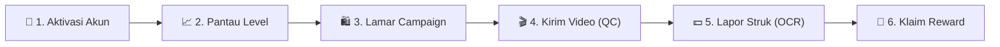
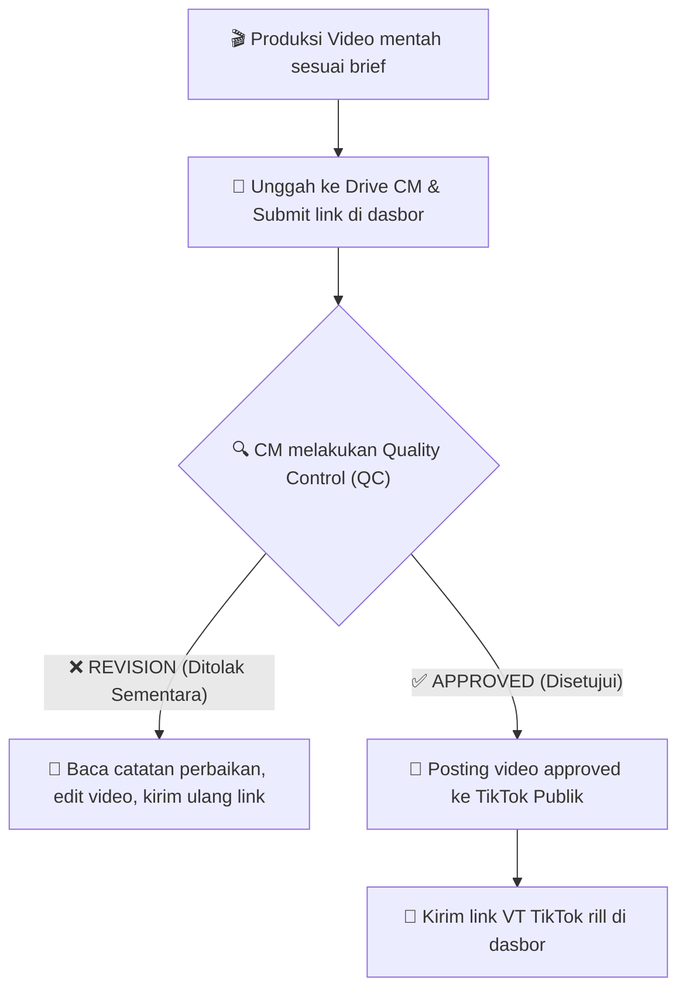

# 🎬 Panduan Sukses Kreator (Creator Manual Guide) — Dashboard HDA GO

Halo Kreator Hebat! Selamat bergabung di keluarga besar **Haluan Digital Network (HDN)**! 🎉

Dashboard HDA GO adalah rumah digital barumu. Platform ini dirancang khusus sebagai **Growth OS (Sistem Operasi Pertumbuhan)** untuk membantumu melacak pencapaian, berkolaborasi dengan brand-brand ternama (F&B, Hotel, Beauty, dll.), mengunggah hasil karya videomu, hingga mencairkan komisi hasil penjualan secara transparan dan otomatis.

Panduan praktis ini akan menuntunmu langkah demi langkah untuk menguasai Dashboard HDA GO, mulai dari pertama kali login hingga cara mengklaim bonusstaycation gratis! Yuk, simak selengkapnya!

---

## 🏗️ Peta Perjalanan Suksesmu di HDA GO

---

## 🔑 Langkah 1: Aktivasi Akun & Login Pertama Kali

Kamu tidak perlu pusing memikirkan cara membuat akun sendiri. Pendaftaran akun sepenuhnya dibantu oleh **Creator Manager (CM)** bimbinganmu.

### 1. Mendapatkan Akun Baru
*   Creator Manager (CM)-mu akan mendaftarkan biodata, niche konten, dan akun TikTok-mu ke sistem.
*   Setelah didaftarkan, akunmu otomatis aktif. CM akan mengirimkan detail email login Anda beserta **Sandi Bawaan (Default Password)**.

### 2. Cara Masuk (Login) ke Dashboard
1.  Buka web browser di handphone atau laptopmu, lalu masuk ke alamat: `https://dashboardhdago.com/login` (atau alamat server yang diberikan CM).
2.  Masukkan **Email** yang terdaftar dan kata sandi bawaan berikut:
    *   **Password Default**: `HdaGo123!`
3.  Klik tombol **"Sign In"**.

### 3. Wajib: Ganti Password Default-mu!
> [!WARNING]
> Demi keamanan akunmu dan melindungi data komisi penjualanmu, kamu **sagas sangat disarankan segera mengganti password default** sesaat setelah berhasil masuk pertama kali.
*   **Cara Mengganti Password**:
    1.  Di menu sebelah kiri (sidebar), klik **"Settings"** (Pengaturan Akun).
    2.  Masukkan password lama: `HdaGo123!`.
    3.  Ketik password barumu yang unik dan mudah kamu ingat.
    4.  Klik **"Save Changes"** (Simpan Perubahan).

---

## 📈 Langkah 2: Mengenal Growth OS (Sistem Kasta Level Kreator)

Di HDA GO, karyamu sangat dihargai! Sistem kami menggunakan **Leveling Engine** otomatis yang melacak total penjualan nyata (**GMV**) dan jumlah pesanan (**Orders**) dari keranjang afiliasi TikTok-mu. Semakin tinggi levelmu, semakin mewah brand dan hotel staycation yang bisa kamu lamar!

### Tingkatan Level Kreator & Keuntungannya

| Level | Nama Kasta | Syarat Akumulasi GMV | Syarat Pesanan (*Orders*) | Akses Hak Istimewa |
| :---: | :--- | :--- | :---: | :--- |
| **0** | **Bronze** | Rp 0 | 0 | Kamu baru mulai! Bisa mendaftar kampanye F&B dasar. |
| **1** | **Silver** | $\ge$ **Rp 1.500.000** | **15** | Akses ke kampanye dengan tipe komisi lebih tinggi. |
| **2** | **Gold** | $\ge$ **Rp 7.500.000** | **75** | **Bisa mulai staycation gratis** di hotel mitra standar! |
| **3** | **Platinum** | $\ge$ **Rp 18.000.000** | **180** | Prioritas staycation di hotel mewah barter video. |
| **4** | **Diamond** | $\ge$ **Rp 50.000.000** | **500** | Akses fee kerja sama flat premium (*Fixed Fee*). |
| **5** | **Elite** | $\ge$ **Rp 150.000.000** | **1.500** | Kasta tertinggi! Prioritas utama VIP dan bonus khusus. |

### Cara Melihat Progres Levelmu
*   Buka halaman **"Overview"** (`/creator/overview`) di dasbor.
*   Kamu akan melihat **Progress Bar** persentase kemajuanmu.
*   Sistem akan menuliskan informasi sisa target secara dinamis, misalnya: *"Kurang Rp 2.450.000 GMV & 12 Orders lagi untuk naik ke Level 2 (Gold)!"*.

> [!TIP]
> **WebSocket Live Confetti Celebration**:
> Jika levelmu berhasil dinaikkan oleh CM/BD karena pencapaianmu yang luar biasa, layar dasbormu akan langsung memunculkan semburan confetti pesta warna-warni yang meriah secara real-time tanpa perlu memuat ulang halaman! 🥳🎉

---

## 🛍️ Langkah 3: Menemukan & Melamar Kampanye Brand Premium

Apakah kamu ingin me-review restoran viral, atau merencanakan liburanstaycation akhir pekan ini? Semuanya bisa dicari di menu kampanye.

### Cara Melamar Kampanye:
1.  Klik menu **"Campaign"** (`/creator/campaign`) di sebelah kiri dasbor.
2.  Kamu akan melihat daftar kampanye aktif yang dibuka oleh brand. Setiap kampanye mencantumkan:
    *   **Kategori** (F&B, Hotel, Beauty, Tech, dll.).
    *   **Syarat Level Minimum** (misal: Minimal Level 2 - Gold).
    *   **SOW (Scope of Work)**: Jumlah video wajib yang harus kamu buat (misal: 2 Video TikTok).
    *   **Tipe Reward**: `FIXED` (Biaya flat) atau `COMMISSION` (Komisi bagi hasil penjualan).
    *   **Kuota Slot**: Sisa kuota kreator yang bisa mendaftar.
3.  Cari kampanye yang kamu inginkan. Jika levelmu memenuhi syarat, klik tombol **"Lamar Kampanye" (Apply)**.
4.  Jika levelmu belum mencukupi, tombol pendaftaran akan otomatis terkunci dengan simbol gembok 🔒 untuk memotivasimu naik level terlebih dahulu!

---

## 🎬 Langkah 4: Siklus Pengumpulan Tugas Video & Review (QC)

Setelah lamaran kampanyemu disetujui oleh BD, saatnya kamu berkreasi membuat video terbaik sesuai arahan taklimat (*brief*)!

### Alur Penyerahan Video (Step-by-Step):

### 1. Mengunggah Video Mentah ke Dasbor
*   Buat videomu terlebih dahulu sesuai taklimat (*brief*) PDF kampanye.
*   Unggah berkas mentah video berkualitas tinggi tersebut ke folder Google Drive milik CM pengampumu (tautan folder Drive diberikan oleh CM).
*   Masuk ke menu **"Submissions"** (`/creator/submissions`) di dasbormu.
*   Pilih nama kampanye yang diikuti, lalu salin (*paste*) tautan link Google Drive videomulah ke kolom **"Tautan Drive Video"**.
*   Klik **"Kirim ke CM"**. Status tugasmu akan berubah menjadi `'QC_REVIEW'`.

### 2. Memantau Status Quality Control (QC)
*   CM pengampumu akan memeriksa kelayakan video di antrean QC mereka.
*   **Jika Butuh Perbaikan (`REVISION`)**: Kamu akan melihat teks berwarna merah berisi catatan revisi CM secara jelas (misal: *"Watermark HDA-GO di detik ke-5 kurang terlihat, tolong diperbesar"*). Edit kembali videomumu dan kirimkan tautan baru di kolom yang sama.
*   **Jika Disetujui (`APPROVED`)**: Kamu akan mendapat notifikasi sukses. Sekarang, saatnya memposting video tersebut ke akun TikTok publikmu!

### 3. Melaporkan Tautan VT TikTok Publik
*   Setelah videomu resmi tayang di TikTok, salin tautan link video TikTok-mu (VT Link), contoh: `https://www.tiktok.com/@kreatormu/video/1234567890`.
*   Masuk ke halaman tugasmu di dasbor, klik tombol **"Kirim VT Link TikTok"**, masukkan tautan yang disalin, dan simpan. Status tugasmu kini berubah menjadi `'COMPLETED'`!

---

## 💵 Langkah 5: Melaporkan Penjualan Mandiri (Self-Report GMV & OCR)

Jika video review-mu berhasil memikat penonton dan menghasilkan penjualan keranjang kuning afiliasi, saatnya kamu melaporkan pencapaianmu agar sistem mencatat nominal GMV dan pesananmu untuk kenaikan level!

### Cara Melaporkan Transaksi Penjualan:
1.  Ambil tangkapan layar (*screenshot*) bukti struk penjualan / komisi komersial dari dasbor TikTok Shop Afiliasimu. Pastikan gambar jernih dan angka-angka terlihat terang.
2.  Buka menu **"Submissions"** di dasbor, lalu masuk ke tab **"Self-Report"** (Lapor Mandiri).
3.  Klik tombol **"Lapor Transaksi Baru"**.
4.  Unggah berkas foto tangkapan layar struk belanjamu ke dalam kotak unggahan (*dropzone*).
5.  Klik **"Kirim Bukti"**.

### Bagaimana Sistem Memproses Laporanmu?
*   Sistem HDA GO dilengkapi dengan **AI OCR Engine (Tesseract.js)**. Sesaat setelah kamu mengirim foto, mesin pintar ini akan memindai teks gambar secara otomatis untuk membaca nominal GMV, ID Pesanan, dan jumlah transaksi.
*   Laporan akan masuk ke antrean verifikasi CM. CM akan memvalidasi keaslian struk dan menyetujuinya. Begitu disetujui, akumulasi GMV dasbormu akan langsung bertambah dan membantumu naik level secara instan!

---

## 🎁 Langkah 6: Klaim Hadiah Staycation & Pantau Komisi

Pekerjaan hebat layak mendapatkan penghargaan hebat! Di Dashboard HDA GO, kamu bisa memantau aliran pendapatanmu secara transparan.

*   **Pantau Saldo & Komisi**: Klik menu **"Rewards"** (`/creator/rewards`) untuk memantau status komisi per video (apakah masih *Pending*, sudah disetujui brand *Approved*, atau sudah ditransfer ke rekeningmu *Paid*).
*   **Staycation Stay Barter**: Jika kamu sudah mencapai **Level 2 (Gold)** ke atas, kamu berhak mendaftar jadwal kunjungan menginap gratis di hotel mewah mitra HDA GO. Koordinasikan tanggal menginap impianmu dengan BD dan CM, lalu pantau konfirmasi jadwal kamarmu di menu **Hotels / Visits**.

---

## 💬 Butuh Bantuan? Hubungi CM-mu!

Jika kamu mengalami kendala login, kesalahan pembacaan sistem OCR pada unggahan struk belanjamu, atau membutuhkan klarifikasi taklimat (*briefing*) kampanye, jangan ragu untuk berdiskusi dengan **Creator Manager (CM)** bimbinganmu. Kami di sini untuk membantumu tumbuh bersama!

Selamat berkreasi, buat konten terbaikmu, dan mari melangkah naik level di HDA GO! 🚀✨
