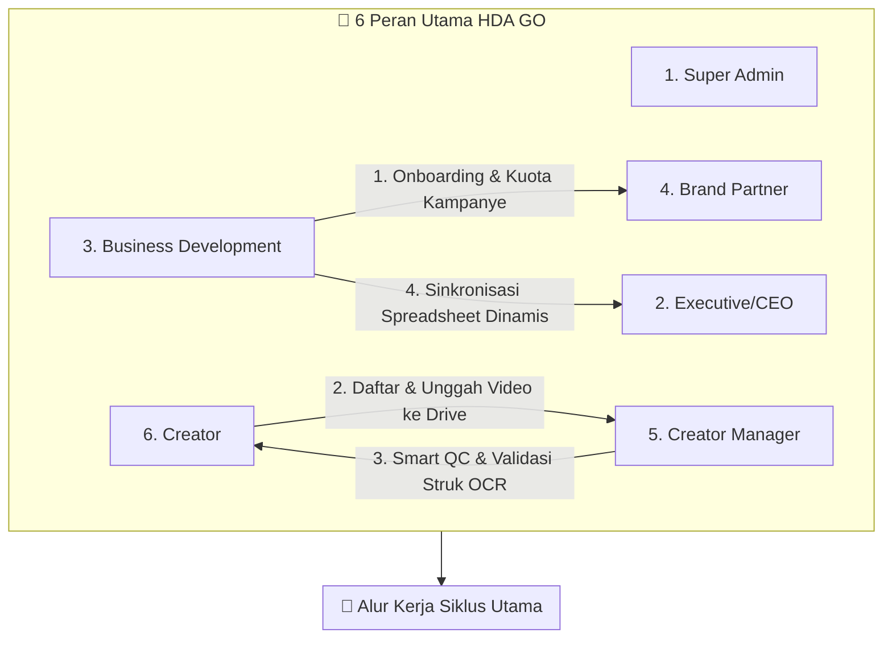

# 🌌 Panduan Manual Pengguna (Manual Guide) Resmi Ekosistem Dashboard HDA GO

Selamat datang di Panduan Manual Pengguna Resmi **Dashboard HDA GO**. Platform ini dikembangkan sebagai sistem operasi terpadu (*one-stop operating system*) untuk mengotomatisasi, menyelaraskan, dan mengamankan seluruh lini operasional bisnis **Haluan Digital Network (HDN)**. 

Dashboard HDA GO dirancang untuk menjembatani kolaborasi komersial antara **Brand Partner**, **Kreator**, **Creator Manager (CM)**, **Business Development (BD)**, dan **Executive/CEO** secara transparan, akurat, dan berbasis data real-time.

---

## 🏗️ 1. Gambaran Umum & Arsitektur Teknologi

Dashboard HDA GO dibangun menggunakan arsitektur modern berkecepatan tinggi yang menjamin efisiensi sistem dalam skala besar:
*   **Frontend**: Next.js (Tailwind CSS, Lucide Icons, Axios, Context State Management).
*   **Backend**: NestJS (TypeScript, Prisma ORM v7, SQLite Database `dev.db`).
*   **Real-Time Layer**: WebSockets (Socket.io) untuk menyalurkan notifikasi langsung dan pemicu selebrasi naik level tanpa memuat ulang halaman (*zero-refresh*).
*   **AI OCR Engine**: Tesseract.js yang ditanamkan secara lokal di server untuk pemindaian gambar struk belanja (*e-receipt verification*).
*   **Sync Integration**: Google Sheets Live API Integration (Guest CSV Stream Parser) untuk penyelarasan instan basis data kreator dari Google Sheet Master.

Sistem mendefinisikan hak akses menjadi **6 Peran Utama** yang saling berinteraksi secara dinamis melalui data terpusat:



---

## 📈 2. Sistem Tingkatan Level Kreator (Leveling Engine)

Dashboard HDA GO menerapkan mesin kalkulasi level (*leveling engine*) otomatis yang melacak pertumbuhan performa kreator berdasarkan pencapaian **Total GMV (Gross Merchandise Value)**, **Jumlah Pesanan (Orders)**, **Konsistensi Posting**, dan **Partisipasi Live**.

Tingkatan level kreator ini memengaruhi hak akses mereka dalam melamar kampanye brand premium dengan batas kuota minimum yang ditentukan oleh pemilik produk.

### Kriteria Kasta Level Kreator HDA GO (4-Level System)
Sistem secara otomatis mengevaluasi pencapaian kreator dan mengelompokkannya ke dalam **4 tingkatan** berikut:

| Level | Kasta / Sebutan | Syarat Min. GMV | Syarat Min. Kampanye | Syarat Min. Orders | Syarat Konsistensi | Syarat Live | Keuntungan Utama |
| :---: | :--- | :--- | :---: | :---: | :---: | :---: | :--- |
| **1** | **Bronze** 🟠 | Rp 0 | 0 | 0 | 0% | 0 | Level awal, akses kampanye dasar non-hotel. |
| **2** | **Silver** ⚪ | $\ge$ **Rp 5.000.000** | **3** | **50** | **30%** | 0 | Akses ke kampanye komisi premium. |
| **3** | **Gold** 🟡 | $\ge$ **Rp 25.000.000** | **10** | **250** | **55%** | **5** | Akses kampanye Hotel & staycation. |
| **4** | **Platinum** 🔵 | $\ge$ **Rp 100.000.000** | **30** | **1.000** | **75%** | **15** | Akses penuh VIP campaigns & bonus eksklusif. |

> [!TIP]
> **WebSocket Live Confetti Celebration**:
> Ketika seorang CM meningkatkan level kreator di panel bimbingan, sistem akan mengirimkan sinyal WebSocket ke peramban kreator secara instan. Dasbor kreator akan langsung memicu popup popup visual selebrasi confetti warna-warni yang meriah sebagai bentuk apresiasi atas kemajuan mereka!

> [!NOTE]
> **Level Awal Default**: Setiap kreator baru yang terdaftar (baik melalui self-registration maupun onboarding CM) akan otomatis ditetapkan pada **Level 1 (Bronze)**. Evaluasi level dilakukan secara otomatis setelah sinkronisasi GMV dari Google Sheets.

---

## 🆔 2.1. Sistem Identifikasi Creator ID & CM Code

Dashboard HDA GO menggunakan **kode identifikasi unik** untuk menjaga konsistensi data walaupun terjadi perubahan nama kreator atau CM.

### Creator ID (creator_code)
- **Format**: Angka panjang numerik dari Google Sheet (misal: `7145781983607374874`) — umumnya merupakan TikTok User ID.
- **Fungsi**: Sebagai **primary business key** untuk setiap kreator. Jika kreator mengganti nama atau username TikTok, data mereka tetap konsisten karena identifikasi menggunakan Creator ID, **bukan** nama.
- **Wajib?**: **Tidak wajib** saat registrasi mandiri oleh kreator. Creator ID bersifat **opsional** dan akan diisi/diingatkan oleh CM.
- **Status di Dashboard**:
  - ✅ **Terdaftar di Sheet** — Creator ID sudah terisi dan tersinkron dengan Google Sheet.
  - ⚠ **Belum Terdaftar** — Creator ID belum diisi, ditandai badge kuning pada tabel daftar kreator.

### CM Code (cm_code)
- **Format**: Kode unik teks untuk identifikasi Creator Manager.
- **Fungsi**: Digunakan saat sinkronisasi Google Sheet untuk mencocokkan kolom **CM** pada sheet dengan pengguna CM di database. Sistem mencari berdasarkan `cm_code` terlebih dahulu, lalu *fallback* ke pencocokan nama.

---

## 📊 2.2. Pelacakan Performa Mingguan (Weekly Stats)

Dashboard HDA GO kini melacak **GMV dan Orders per minggu** melalui model `CreatorWeeklyStats`. Data ini diperbarui setiap kali sinkronisasi Google Sheet dilakukan.

### Detail Pelacakan
| Field | Keterangan | Contoh |
|-------|------------|--------|
| `week_label` | Label minggu ISO | `2026-W24` |
| `week_start` | Tanggal Senin awal minggu | `2026-06-09` |
| `week_end` | Tanggal Minggu akhir minggu | `2026-06-15` |
| `gmv` | Total GMV minggu tersebut | `Rp 3.500.000` |
| `orders` | Total orders minggu tersebut | `12` |
| `gmv_updated_at` | Timestamp terakhir data diperbarui | `2026-06-15 11:30:00` |
| `source` | Sumber data | `SHEET_SYNC`, `MANUAL`, `SELF_REPORT` |

### Akses Data Weekly Stats
- **Endpoint API**: `GET /bd/creators/weekly-stats?week=2026-W24`
- **Filter**: Dapat memfilter berdasarkan label minggu tertentu.
- **Dropdown**: Menampilkan 12 minggu terakhir yang tersedia.

---

## 👥 3. Panduan Fitur & Fungsionalitas Berdasarkan Peran & Rute

---

### A. Dasbor Brand Partner (Mitra Brand)
Pintu gerbang bagi pemilik usaha (Restoran, Hotel, Toko Kecantikan) untuk merilis kampanye promosi, membagikan dokumen taklimat (*briefing*), dan melihat pengembalian investasi (ROI) secara transparan.

#### 1. Halaman Ringkasan Dashboard (`/brand`)
*   **Fungsi**: Menyajikan gambaran umum efektivitas seluruh kampanye brand yang terdaftar.
*   **Metrik Utama**:
    *   **Total Anggaran Aktif**: Dana total yang diinvestasikan dalam kampanye yang sedang berjalan.
    *   **Partisipasi Kreator**: Jumlah kreator yang saat ini berkontribusi dalam pembuatan konten.
    *   **SOW Progress**: Rasio penyelesaian video wajib dibandingkan target taklimat (*brief*).
    *   **Total GMV Terbentuk**: Nilai penjualan nyata yang sukses didorong oleh video kampanye.
*   **Grafik Penjualan**: Kurva fluktuasi harian konversi pesanan dan GMV untuk melihat hari puncak penjualan.

#### 2. Pendaftaran & Manajemen Kampanye (`/brand/campaigns`)
*   **Fungsi**: Membuat usulan kampanye promosi baru dan melacak perkembangannya dari draf hingga selesai.
*   **Cara Membuat Kampanye Baru**:
    1. Klik tombol **"Buat Kampanye Baru"** untuk menampilkan formulir pembuatan.
    2. Masukkan **Judul Kampanye** yang representatif (contoh: *Review Staycation Hotel Aston Dago*).
    3. Pilih **Kategori Kampanye** (pilihan: `HOTEL`, `FNB`, `TTD`, `LIVE`, `BEAUTY`, `TECH`).
    4. Atur **Syarat Level Minimum Kreator** (Level 0 - Level 5) untuk menjamin kualitas pembuat konten.
    5. Masukkan **SOW (Scope of Work)**: Jumlah total video yang wajib diposting oleh setiap kreator terpilih (misal: 2 video TikTok).
    6. Atur **Kuota Slot Kreator** (misal: 10 orang).
    7. Tentukan **Tipe Reward**:
        *   `FIXED`: Pembayaran dana flat setelah video lolos QC (misal: Rp 500.000 per orang).
        *   `COMMISSION`: Pembayaran berdasarkan persentase nominal penjualan yang terjadi.
    8. Input **Total Anggaran (Budget)** yang dialokasikan.
    9. Unggah **Dokumen Taklimat (Brief PDF)** melalui area unggahan berkas.
    10. Klik **"Kirim ke BD"**. Kampanye akan masuk dengan status `'PENDING_BD'` ke dalam antrean review BD.

#### 3. Detail Analisis ROI & Metrik Kreator (`/brand/analytics`)
*   **Fungsi**: Membedah performa per video dari setiap kreator yang berpartisipasi.
*   **Rincian Data**:
    *   Tautan video TikTok rill yang diposting kreator beserta statistik penonton (*views*), *likes*, dan komentar.
    *   Daftar komisi terakumulasi yang berhak diterima kreator.
    *   Unduh Laporan: Tombol untuk mengunduh laporan performa kampanye dalam bentuk file PDF untuk keperluan presentasi internal brand.

---

### B. Dasbor Business Development (BD) — Command Center
Pusat kendali operasional komersial untuk meninjau kampanye brand, mengelola jadwal staycation hotel, dan mengintegrasikan data GMV eksternal dari Google Sheets.

> [!IMPORTANT]
> Halaman utama BD berada di rute `/bd`. Ini adalah panel pengendali utama yang paling sering diakses oleh tim BD.

#### 1. Integrasi Sinkronisasi Google Sheets Terpadu — 12 Kolom (`/bd`)
*   **Fungsi**: Menghubungkan platform HDA GO langsung dengan lembar kerja Google Sheets Master untuk menyelaraskan **seluruh 12 kolom data kreator** secara otomatis tanpa perantara file lokal.
*   **12 Kolom yang Disinkronkan**:

    | # | Kolom Sheet | Field Database | Keterangan |
    |---|-------------|----------------|------------|
    | A | **Fenoy** | `start_date` | Tanggal awal kontrak kerja sama |
    | B | **Tanggal Expired** | `end_date` | Tanggal akhir kontrak |
    | C | **Creator ID** | `creator_code` | Primary key bisnis (TikTok User ID) — **prioritas matching #1** |
    | D | **Nama** | `User.name` | Nama asli kreator |
    | E | **Creator Username** | `tiktok_username` | Username TikTok — **fallback matching #2** |
    | F | **CM** | `cm_id` | Assignment CM (match via `cm_code` atau nama) |
    | G | **Link Profile** | `tiktok_url` | URL profil TikTok |
    | H | **Followers** | `tiktok_followers` | Jumlah pengikut TikTok |
    | I | **Category Proper** | `niche` | Kategori/niche kreator |
    | J | **Sales Level** | `creator_level` | Level 1-4 (Bronze/Silver/Gold/Platinum) |
    | K | **GMV** (nama berubah per bulan) | `CreatorWeeklyStats.gmv` | GMV per minggu — kolom dikenali via **prefix "GMV"** (misal: "GMV Jun", "GMV Jul") |
    | L | **Order** | `CreatorWeeklyStats.orders` | Jumlah pesanan per minggu |

*   **Cara Penggunaan Fitur Sync**:
    1. Pastikan Google Sheet Master (`https://docs.google.com/spreadsheets/d/1Alp1XHgQtK8CnIW3fFD7p-8HXGDsA5IbYM4Da97btGc`) telah disetel dengan privasi publik (*Anyone with the link can view*).
    2. Pada dasbor BD, klik tombol **"Sinkronkan Google Sheet"**.
    3. Sistem akan memicu *backend parser* untuk mengunduh data langsung dari **GID 1505444998** (Tab lembar kerja *Creator HDA-GO*).
    4. Sistem melakukan normalisasi data secara otomatis:
       - Mencocokkan kreator berdasarkan **Creator ID** (prioritas utama), lalu **username TikTok** sebagai *fallback*.
       - Memperbarui **12 kolom biodata** (nama, followers, niche, level, kontrak, CM, dll).
       - Menyimpan data **GMV & Orders ke Weekly Stats** dengan timestamp dan label minggu ISO.
       - Memicu **kalkulator level** untuk setiap kreator yang datanya berubah.
    5. **Badge Info Sync**: Setelah sinkronisasi, dashboard menampilkan:
       - 📅 **Label Minggu** (misal: `2026-W24`) — Periode minggu data.
       - 📊 **Nama Kolom GMV** (misal: `GMV Jun`) — Kolom mana yang dibaca dari Sheet.
       - 🕐 **Timestamp Sync** — Waktu terakhir sinkronisasi dilakukan.
    6. **Laci Detail Kreator Terupdate** (*Detail Drawer*): Klik laci interaktif ini untuk memunculkan daftar kreator yang datanya sukses diperbarui. Setiap kreator menampilkan:
       - Rincian penambahan nominal GMV dan jumlah pesanan (misal: `GMV +Rp 2.910.928 | Orders +1`).
       - **Badge perubahan field** — menunjukkan field mana saja yang berubah (misal: `followers`, `niche`, `sales_level`, `cm`, `start_date`).
       - Jika hanya biodata yang berubah tanpa GMV, ditampilkan label `"Biodata updated"`.
    7. **Laci Baris Data Dilewati** (*Skipped Rows Drawer*): Klik laci ini untuk mengaudit data mana saja yang diabaikan oleh sistem beserta alasannya (misal: `"Creator '7145781983607374874' tidak terdaftar di sistem HDA-GO"`).

> [!IMPORTANT]
> **Logika Matching Kreator**:
> Saat sinkronisasi, sistem mencari kreator di database dengan urutan prioritas:
> 1. **Creator ID** (`creator_code`) — cocokkan angka panjang dari kolom C Sheet.
> 2. **Username TikTok** (`tiktok_username`) — *fallback* jika Creator ID tidak ditemukan.
> Jika keduanya tidak cocok, baris tersebut dilewati dan masuk ke laci *Skipped Rows*.

#### 1.1. Daftar Kreator Belum Terdaftar di Sheet
*   **Endpoint**: `GET /bd/creators/unregistered`
*   **Fungsi**: Menampilkan daftar kreator yang belum memiliki **Creator ID** atau belum tersinkron dengan Google Sheet.
*   **Kegunaan**: Membantu BD/CM untuk mengidentifikasi kreator mana yang perlu ditambahkan Creator ID-nya.

#### 1.2. Notifikasi Reminder Sinkronisasi Mingguan
*   **Endpoint**: `POST /bd/creators/send-sync-reminder` (hanya ADMIN)
*   **Fungsi**: Mengirimkan notifikasi reminder ke seluruh pengguna BD untuk melakukan sinkronisasi Google Sheet minggu ini.
*   **Format Pesan**: *"📊 Reminder: Silakan lakukan sinkronisasi Google Sheet untuk memperbarui data GMV & Orders kreator minggu ini."*

#### 2. Pengimpor Spreadsheet Berkas Lokal (`/bd`)
*   **Fungsi**: Sebagai cadangan jika koneksi Google Sheets API mengalami gangguan, BD dapat menyeret berkas Excel/CSV lokal ke area dropzone.
*   **Teknologi Auto-Seeking Tabs**:
    *   Algoritma cerdas platform akan memindai isi berkas excel secara dinamis untuk menemukan lembar kerja (*tab*) mana yang berisi metrik kreator secara case-insensitive (mencocokkan nama tab yang mengandung unsur kata kunci: `Creator`, `GMV`, `Onboarding`, atau `Sales`).

#### 3. Tinjauan Antrean Kampanye Brand (`/bd/campaigns`)
*   **Fungsi**: Menyetujui atau memberikan umpan balik perbaikan pada kampanye yang diusulkan oleh Brand.
*   **Opsi Tindakan**:
    *   **Approve**: Mengubah status kampanye menjadi `'BD_APPROVED'`, sehingga kampanye resmi dirilis dan dapat didaftar oleh para kreator yang memenuhi syarat level.
    *   **Revision**: Mengirimkan kembali draf kampanye kepada brand dengan menyertakan catatan koreksi detail (misal: "Kuota terlalu sedikit untuk tipe komisi tetap").
    *   **Edit Campaign Logs**: BD dapat langsung mengoreksi tenggat waktu (*deadline*) atau kuota kampanye secara langsung tanpa harus mengembalikannya ke brand. Seluruh riwayat perubahan akan terekam otomatis pada tabel `CampaignEditLog` sebagai *audit trail*.

#### 4. Manajemen Mitra Hotel & Staycation Scheduler (`/bd/hotels`)
*   **Fungsi**: Mengelola kemitraan dengan hotel (staycation) dan menjadwalkan kunjungan konten kreator.
*   **Fungsionalitas**:
    *   **Database Hotel**: BD dapat menambah hotel baru, mengatur kategori (Hotel, Resort, Villa), kontak PIC hotel, kuota kamar bulanan, dan fasilitas (kolam renang, gym, sarapan gratis).
    *   **Penjadwal Staycation** (*Visit Scheduler*): Membuat jadwal kunjungan staycation kreator dengan detail:
        *   Tipe Kolaborasi: `VISIT_ONLY` (Kunjungan liputan), `BARTER_STAY` (Menginap barter video), atau `BARTER_DINING` (Barter makan restoran).
        *   Tanggal & Waktu Rencana Kedatangan.
        *   Status Kunjungan: `PENDING`, `APPROVED` (Kamar terkonfirmasi), `COMPLETED` (Kunjungan selesai), `CANCELLED` (Batal).

#### 5. Analitik & Laporan Pertumbuhan Bisnis (`/bd/analytics` & `/bd/history`)
*   **Fungsi**: Menampilkan riwayat penuh sinkronisasi data sheet, grafik omset bisnis nasional, persebaran niche kreator terpopuler, serta efektivitas ROI kemitraan hotel.

---

### C. Dasbor Creator Manager (CM) — Pengawas Kualitas & QC
Garda terdepan yang bertugas mendampingi kreator, memastikan kepatuhan video terhadap arahan kreatif, dan memvalidasi keabsahan bukti struk belanja afiliasi.

#### 1. Registrasi & Onboarding Kreator Baru (`/cm/creators`)
*   **Fungsi**: Mendaftarkan kreator baru ke ekosistem HDA GO dan membuatkan mereka kredensial login.
*   **Formulir Onboarding Lengkap**:
    *   **Creator ID (Opsional)**: Kode unik dari Google Sheet (misal: `7145781983607374874`). Jika belum tersedia, bisa dikosongkan dan diisi nanti oleh CM. Placeholder: *"Akan diisi/diingatkan oleh CM"*.
    *   **Identitas**: Nama Lengkap, Nomor WhatsApp, Jenis Kelamin, Tanggal Lahir, Kota Domisili.
    *   **Media Sosial**: Username TikTok, Link Profil TikTok, Jumlah Followers, Rata-rata Views.
    *   **Niche & Pengalaman**: Kategori konten (FNB, Beauty, Fashion, Travel), Pengalaman Afiliasi (Baru, Pernah, Aktif).
    *   **Kontrak Bulanan**: SOW Target Video bulanan (misal: 4 video wajib) dan target nominal GMV.
*   **Kredensial Otomatis**: Setelah disimpan, akun pengguna baru akan otomatis terbuat di database dengan sandi bawaan default: `HdaGo123!`.
*   **Default Level**: Kreator baru otomatis ditetapkan pada **Level 1 (Bronze)**.
*   **Sheet Status**: Jika Creator ID diisi saat onboarding, kreator langsung ditandai sebagai `sheet_registered = true`.

#### 2. Dasbor Pemantauan Bimbingan (`/cm/monitoring`)
*   **Fungsi**: Melihat secara komprehensif tingkat kepatuhan dan keaktifan para kreator di bawah bimbingan CM tersebut.
*   **Metrik Pantau**:
    *   Kreator dengan performa GMV tertinggi bulan ini.
    *   Kreator tidak aktif (*inactive streak*) yang sudah melebihi 14 hari tidak memposting video.
    *   Notifikasi real-time jika kreator bimbingan mengunggah video QC baru.

#### 3. Antrean Kontrol Kualitas Video (`/cm/pipeline` atau `/qc`)
*   **Fungsi**: Wadah peninjauan video taklimat pra-posting sebelum kreator mengunggahnya secara publik ke media sosial.
*   **Smart QC Layout**:
    *   Sistem mendeteksi tautan yang dikirim oleh kreator. Jika tautan tersebut merupakan tautan Google Drive, sistem akan memunculkan tombol visual premium berwarna hijau bertuliskan **"Open GDrive Folder"**. Ini memudahkan CM untuk langsung mengakses berkas mentah video berkualitas tinggi tanpa ribet menyalin tautan secara manual.
*   **Keputusan QC**:
    *   **Approve**: Menyetujui video. Status tugas berubah menjadi `'APPROVED'`. Sistem mengirim notifikasi WebSocket confetti ke kreator untuk segera diposting ke TikTok.
    *   **Revision**: Mengembalikan video dengan pesan revisi terperinci (misal: *"Audio musik latar terlalu keras, suara penjelasan produk tenggelam. Mohon kecilkan 20%"*).
    *   **QC Score & Tags**: CM wajib memberikan skor kualitas video (1-5 bintang) dan label internal (seperti: *"Best Practice"*, *"Under-delivery"*, *"Low lighting"*) untuk bahan evaluasi.

#### 4. Validasi Struk Belanja OCR (`/qc` - Antrean Receipt)
*   **Fungsi**: Memeriksa validitas bukti tangkapan layar struk belanja komisi yang diunggah secara mandiri oleh kreator.
*   **Alur Kerja Cerdas OCR**:
    1. Sistem backend NestJS secara otomatis mengurai teks gambar struk menggunakan pustaka **Tesseract.js OCR Engine** setelah kreator mengunggahnya.
    2. Layar antrean CM akan menampilkan gambar asli struk bersandingan dengan data teks hasil ekstraksi mesin OCR (Membaca nominal GMV, jumlah item, tanggal, dan Order ID).
    3. **Penyelarasan Manual (Override)**: CM bertindak sebagai auditor akhir. Jika pembacaan OCR sudah 100% tepat, CM tinggal mengklik tombol **"Sahkan Struk"**. Jika terdapat salah ketik atau gambar agak buram, CM dapat menulis ulang nilai koreksi nominal GMV pada input *override* nominal sebelum menyetujui, menjamin akurasi data finansial.

---

### E. Dasbor Kreator (Creator Dashboard) — Growth OS
Dasbor personal bagi konten kreator yang berfungsi sebagai pusat motivasi, pelaporan mandiri, pelacakan level kemajuan, dan klaim bonus komersial.

#### 1. Panel Ringkasan Kemajuan Level (`/creator/overview`)
*   **Fungsi**: Memvisualisasikan posisi kasta level kreator saat ini dan apa saja syarat konkret yang harus dicapai untuk naik tingkat.
*   **Visual Indicator**:
    *   **Judul Level Berwarna Gradien**: Header menampilkan level dengan nama kasta dan warna gradient yang sesuai (misal: *"Level 3 — Gold"* dengan gradasi kuning-emas).
    *   **Warna Level**: Bronze (oranye), Silver (abu-abu), Gold (kuning-emas), Platinum (biru-cyan).
    *   **Progress Bar Dinamis**: Persentase kemajuan menuju level berikutnya.
    *   **Milestones Target**: Menampilkan angka sisa GMV kurang berapa rupiah lagi, dan sisa pesanan kurang berapa buah lagi untuk naik tingkat (misal: *"Kurang Rp 2.450.000 GMV & 12 Orders lagi untuk naik ke Level 3 (Gold)!"*).
    *   **Status Kontrak**: Badge kontrak aktif/segera berakhir/habis langsung ditampilkan di header level.

#### 2. Portal Pencarian Kampanye Terbuka (`/creator/campaign`)
*   **Fungsi**: Menelusuri seluruh kampanye yang sedang aktif dibuka oleh Brand & BD.
*   **Penerapan Filter Otomatis**:
    *   Kreator hanya dapat mengklik tombol **"Lamar Kampanye"** (Apply) jika level mereka memenuhi atau berada di atas batas level minimum kampanye tersebut. Jika level tidak cukup, tombol akan terkunci secara visual dengan ikon gembok premium.

#### 3. Pengumpulan Tugas Video & Laporan VT Link (`/creator/submissions`)
*   **Fungsi**: Mengirimkan hasil karya video pra-posting untuk dinilai kelayakannya oleh CM pengampu.
*   **Cara Pengumpulan Tugas**:
    1. Pilih kampanye aktif yang sedang diikuti.
    2. Masukkan tautan berkas mentah video di Google Drive (atau unggah langsung) ke kolom **Tautan GDrive Video**.
    3. Tekan tombol **"Kirim ke CM"**. Status tugas akan berubah menjadi `'QC_REVIEW'`.
    4. Kreator memantau status di tabel tugas. Jika CM meminta revisi, teks revisi merah akan muncul secara instan.
    5. Setelah tugas disetujui (`'APPROVED'`), tombol baru **"Kirim VT TikTok Link"** akan terbuka.
    6. Kreator memposting video yang disetujui ke akun TikTok publik mereka, menyalin link VT TikTok aslinya, lalu memasukkannya ke sistem sebagai bukti pelaporan akhir publikasi.

#### 4. Pelaporan Struk Penjualan Mandiri (`/creator/submissions` - Tab Self-Report)
*   **Fungsi**: Melaporkan data penjualan afiliasi dari TikTok Shop secara mandiri menggunakan gambar struk.
*   **Cara Penggunaan**:
    1. Klik tombol **"Lapor Transaksi Baru"**.
    2. Unggah gambar tangkapan layar bukti struk penjualan/komisi TikTok Shop (format JPG/PNG).
    3. Masukkan catatan opsional (misal: "Penjualan dari VT Review Dominos").
    4. Klik **"Kirim Bukti"**. Sistem akan memproses gambar dengan mesin OCR dan memasukkannya ke antrean verifikasi CM dengan status `'PENDING_VERIFICATION'`.

#### 5. Portal Klaim Hadiah & Analitik (`/creator/rewards` & `/creator/analytics`)
*   **Fungsi**: Memantau perolehan total komisi yang siap dicairkan, status pembayaran dari Brand (Pending, Approved, Paid), serta klaim bonus staycation tambahan jika level mereka naik.

---

### E. Dasbor Executive (CEO) — Business Intelligence
Panel eksekutif satu pintu yang dirancang untuk kebutuhan peninjauan tingkat tinggi, pengambilan keputusan strategis, dan audit efisiensi bisnis.

#### 1. Panel Ringkasan KPI Makro (`/executive`)
*   **Fungsi**: Menyajikan gambaran besar kondisi finansial dan kinerja ekosistem HDA GO tanpa terganggu detail teknis harian.
*   **Metrik Makro**:
    *   **Total GMV Ekosistem**: Jumlah total omset penjualan yang sukses didorong oleh jaringan kreator HDA GO secara nasional.
    *   **Rasio ROI Kampanye**: Perbandingan investasi anggaran brand terhadap volume penjualan riil yang tercipta.
    *   **Keaktifan Jaringan Kreator**: Persentase kreator yang aktif mengirimkan tugas video dalam kurun waktu 30 hari terakhir.

#### 2. Evaluasi Kinerja Creator Manager (`/executive/kpi`)
*   **Fungsi**: Memantau performa kerja dari masing-masing CM.
*   **Tabel KPI CM**:
    *   Jumlah kreator di bawah asuhan.
    *   Persentase kelulusan QC tepat waktu dari tugas bimbingan.
    *   Rata-rata kontribusi GMV yang dihasilkan oleh tim kreator bimbingan mereka. Ini memudahkan CEO untuk memberikan bonus tahunan berbasis performa CM (*performance-based bonus*).

#### 3. Papan Peringkat Kreator Nasional (`/executive/kpi` - Leaderboards)
*   **Fungsi**: Menampilkan 10 Kreator dengan performa tertinggi di ekosistem HDA GO.
*   **Fungsionalitas Filter**:
    *   Dapat diurutkan berdasarkan **GMV Tertinggi**, **Orders Terbanyak**, atau **Consistency Streak** (keaktifan harian posting konten).

---

### F. Dasbor Administrator (Super Admin)
Pusat kendali infrastruktur teknis, keamanan data, audit log aktivitas, dan modifikasi data tingkat tinggi (*root access*).

#### 1. Manajemen Akun Pengguna (`/admin/users`)
*   **Fungsi**: Membuat, menyunting, mengaudit, atau membekukan (*suspend*) seluruh akun di platform.
*   **Fungsionalitas**:
    *   Mencari akun berdasarkan nama, surel (*email*), atau peran.
    *   Mengubah peran akun secara bebas (misal: meningkatkan akun CM menjadi BD).
    *   Membekukan akun yang terbukti melakukan fraud manipulasi struk belanja digital.
    *   Melakukan **Reset Kata Sandi** instan ke sandi default maupun kustom jika pengguna lupa akses masuk.

#### 2. Audit Alokasi Kreator & CM (`/admin/cm-management`)
*   **Fungsi**: Mengatur distribusi tanggung jawab pengawasan kreator antar-CM.
*   **Fitur Transfer Kreator**:
    *   Jika seorang CM mengundurkan diri atau mengambil cuti, Admin dapat memindahkan sekelompok kreator di bawah bimbingannya ke CM lain secara massal.
    *   Sistem merekam pemindahan ini ke tabel `CreatorAssignmentLog` untuk menghindari hilangnya jejak sejarah pertanggungjawaban data.

#### 3. Pemeliharaan Sistem & Pengaturan API (`/admin/settings`)
*   **Fungsi**: Mengonfigurasi parameter sistem tingkat lanjut.
*   **Pengaturan**:
    *   Tautan API Kredensial folder Google Drive utama.
    *   Batas tenggat waktu revisi otomatis tugas (default: 2 hari kerja).
    *   Pencadangan (*backup*) basis data SQLite `dev.db` secara berkala.

---

## 🔄 4. Alur Kerja Ujung-ke-Ujung (End-to-End Workflows)

Berikut adalah visualisasi alur interaksi antarkomponen dalam mengeksekusi operasi harian platform HDA GO:

### 1. Siklus Hidup Kampanye: Pendaftaran Hingga Aktif
```
[Brand] Buat Kampanye (Status: PENDING_BD)
   │
   ▼
[BD] Tinjau Kampanye ───► (Tolak/Revisi) ───► Kembali ke [Brand]
   │ (Setuju)
   ▼
[Sistem] Status berubah: ACTIVE
   │ (Kreator dengan Level yang cukup mulai mendaftar)
   ▼
[Kreator] Klik Apply ───► [BD] Setujui Keikutsertaan ───► Slot Terisi
```

### 2. Alur Quality Control (QC) Konten & Publikasi TikTok
```
[Kreator] Upload video mentah ke Folder GDrive CM
   │
   ▼
[Kreator] Masukkan Tautan Drive di Dashboard (Status: QC_REVIEW)
   │
   ▼
[CM] Tinjau di Smart QC Queue (GDrive Link dengan Tombol Hijau Premium)
   │
   ├─► (Revisi) ──► Beri skor 1-3 & Catatan Revisi ──► Kembali ke [Kreator]
   │
   └─► (Setuju) ──► Beri skor 4-5 ──► Kirim WebSocket Confetti ──► Status: APPROVED
                                                                         │
                                                                         ▼
                                                           [Kreator] Posting ke TikTok
                                                                         │
                                                                         ▼
                                                           [Kreator] Kirim Link VT TikTok rill
```

### 3. Alur Verifikasi GMV, Integrasi OCR, & Sinkronisasi Sheets
```
[PILIHAN A: Alur Self-Report]
[Kreator] Upload Gambar Struk Belanja
   │
   ▼
[NestJS Backend] Scan gambar dengan Tesseract.js OCR
   │
   ▼
[CM] Tinjau receipt ──► (Bandingkan Gambar vs Hasil OCR, Override jika perlu) ──► Setujui GMV
                                                                                      │
                                                                                      ▼
                                                                            [Sistem] Simpan DB
                                                                                      ▲
                                                                                      │
[PILIHAN B: Alur Google Sheets Sync]                                                  │
[BD] Klik "Sinkronkan Google Sheet" ──► Fetch GID 1505444998 ─────────────────────────┘
```

---

## ⚡ 5. Panduan Pemeliharaan Teknis & Troubleshooting (Untuk Admin & BD)

### 1. Layar Tampil "502 Bad Gateway" Pasca-Rebuild/Deploy
*   **Deskripsi Masalah**: Setelah menjalankan perintah pembaruan atau pembangunan ulang aplikasi frontend (`npm run build`), browser memunculkan halaman kosong dengan tulisan *502 Bad Gateway*.
*   **Penyebab**: Web server Nginx kehilangan arah koneksi proxy karena aplikasi Next.js membutuhkan jeda waktu beberapa detik untuk menghentikan proses lama dan memicu port lokal baru saat PM2 menyalakan ulang layanan.
*   **Langkah Penanganan**:
    1. Hubungkan terminal Anda ke VPS Server melalui SSH.
    2. Jalankan perintah reload konfigurasi Nginx untuk menyegarkan cache proxy:
       ```bash
       sudo systemctl reload nginx
       ```
    3. Periksa status proses PM2 untuk memastikan frontend Next.js berjalan normal:
       ```bash
       pm2 list
       ```

### 2. Sinkronisasi Google Sheets Mengalami Kegagalan
*   **Deskripsi Masalah**: Ketika BD mengklik tombol "Sinkronkan Google Sheet", sistem memunculkan pesan eror dan data GMV kreator tidak terperbarui.
*   **Langkah Diagnosis & Penanganan**:
    1. **Verifikasi Privasi Spreadsheet**: Buka Google Sheet Master Anda di tab penyamaran (*incognito*). Pastikan setelan berbagi (*Share settings*) diatur ke **"Anyone with the link can view"** (Siapa saja yang memiliki link dapat melihat). Jika disetel privat, backend server tidak dapat mengunduh data CSV.
    2. **Periksa Struktur Kolom**: Algoritma pencarian sistem HDA GO mendeteksi **12 kolom utama** berdasarkan header baris pertama sheet. Pastikan Anda tidak mengubah atau salah mengetik nama kolom berikut:
        *   `Fenoy` — Tanggal awal kontrak.
        *   `Tanggal Expired` — Tanggal akhir kontrak.
        *   `Creator ID` — Kode unik kreator (angka panjang TikTok User ID).
        *   `Nama` — Nama asli kreator.
        *   `Creator Username` — Username TikTok kreator.
        *   `CM` — Nama atau kode CM yang mengelola.
        *   `Link Profile` — URL profil TikTok.
        *   `Followers` — Jumlah pengikut.
        *   `Category Proper` — Niche/kategori konten.
        *   `Sales Level` — Level kreator (1-4).
        *   `GMV*` — Kolom GMV (nama boleh berubah tiap bulan, misal: `GMV Jun`, `GMV Jul`). Sistem mendeteksi kolom apapun yang **diawali** kata `GMV`.
        *   `Order` / `Orders` — Jumlah pesanan.
    3. **Periksa GID Sheet**: Sistem disetel untuk mengunduh spesifik tab *Creator HDA-GO* yang memiliki GID `1505444998`. Jangan menghapus atau memindahkan tab ini.
    4. **Creator Tidak Cocok (Skipped Rows)**: Jika banyak baris dilewati, periksa:
        *   Apakah **Creator ID** di sheet sudah diisi ke database dashboard (via CM onboarding atau edit profil).
        *   Apakah **username TikTok** di sheet sama persis dengan yang terdaftar di dashboard (case-insensitive).
        *   Kreator yang tidak cocok akan ditandai di laci *Skipped Rows* dengan alasan detail.

### 3. Mesin OCR Gagal Membaca Nominal Struk Belanja
*   **Deskripsi Masalah**: Gambar struk yang diunggah kreator menghasilkan pembacaan teks kosong atau nilai GMV menjadi Rp 0 pada layar verifikasi CM.
*   **Penyebab**: Gambar struk buram, pencahayaan minim saat pengambilan foto, tulisan terpotong, atau resolusi gambar terlalu rendah untuk diproses oleh modul Tesseract.js.
*   **Langkah Penanganan**:
    1. CM disarankan untuk memanfaatkan fitur **Override Manual** yang telah disediakan di dasbor QC.
    2. CM tinggal melihat gambar struk secara visual di layar sebelah kiri, lalu mengetikkan nominal angka penjualan yang benar pada kolom input *override* nominal, lalu mengklik tombol **"Sahkan Struk"**. Ini akan mengabaikan pembacaan mesin yang salah dan menuliskan data yang benar ke database.

---

## 🔒 6. Kebijakan Keamanan & Kredensial Pengguna Baru

Demi kelancaran transisi penggunaan platform dan kemudahan onboarding massal kreator baru, HDA GO menetapkan standarisasi kebijakan keamanan berikut:

### 1. Kata Sandi Bawaan Awal (Default Password)
*   Setiap akun baru yang didaftarkan melalui proses penungguhan massal (*seeder*) maupun pendaftaran individu oleh CM akan otomatis dikonfigurasi dengan kata sandi bawaan berikut:
    *   **Password Default**: `HdaGo123!`
*   Kebijakan ini berlaku seragam untuk seluruh tingkat peran (Creator, CM, Brand, BD, Executive, Admin).

### 2. Kewajiban Penggantian Kata Sandi Mandiri
*   > [!WARNING]
    > Demi menjaga kerahasiaan data performa komersial dan menghindari penyalahgunaan akun, **seluruh pengguna baru diwajibkan untuk segera memperbarui kata sandi bawaan** mereka sesaat setelah berhasil masuk pertama kali ke sistem.
*   **Cara Mengganti Sandi**:
    1. Masuk ke halaman utama dashboard.
    2. Klik menu **"Settings"** (Pengaturan Akun) pada bagian bawah sidebar navigasi sebelah kiri.
    3. Masukkan kata sandi lama (`HdaGo123!`).
    4. Tuliskan kata sandi baru Anda yang unik (minimal 8 karakter, mengandung perpaduan huruf besar, angka, dan simbol khusus).
    5. Klik **"Simpan Perubahan"**.

---

*Panduan Manual Pengguna ini disusun dan diperbarui secara berkala oleh Tim Teknis Haluan Digital Network (HDN) untuk menjamin keselarasan dengan pembaruan fitur dashboard versi terbaru. Hak Cipta © 2026 Haluan Digital Network.*
