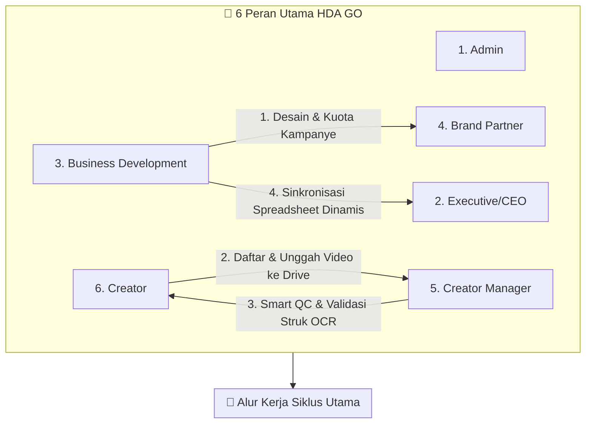
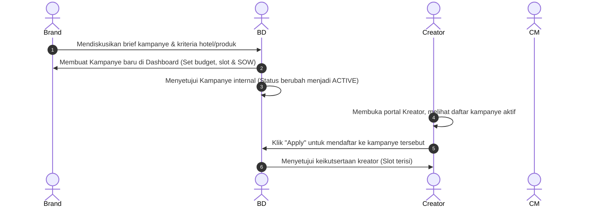
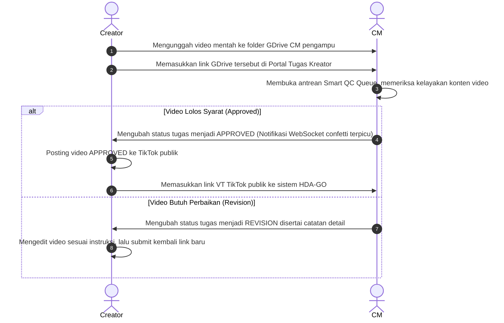

# 🌌 Panduan Manual Pengguna (Manual Guide) & Dokumentasi Ekosistem Dashboard HDA GO

Selamat datang di Panduan Manual Pengguna Resmi **Dashboard HDA GO**. Sistem ini dirancang sebagai sistem operasi satu pintu (*one-stop operating system*) yang mengintegrasikan seluruh lini bisnis **Haluan Digital Network (HDN)** dalam mengelola kerja sama komersial antara **Brand**, **Kreator**, **Creator Manager (CM)**, **Business Development (BD)**, dan **Executive/CEO**.

Dokumen ini membedah seluruh fungsionalitas sistem secara mendalam, terperinci, dan sistematis per peran aktor dari awal hingga akhir.

---

## 🏗️ 1. Gambaran Umum & Arsitektur Teknologi

Dashboard HDA GO dibangun menggunakan arsitektur modern berkecepatan tinggi:
* **Frontend**: Next.js (Tailwind CSS, Lucide Icons, Axios Client terintegrasi).
* **Backend**: NestJS (TypeScript, Prisma ORM v7, SQLite Database `dev.db`).
* **Real-Time Layer**: WebSockets (Socket.io) untuk notifikasi instan dan selebrasi kenaikan tingkat kreator secara langsung (*zero-refresh*).
* **AI & Integration**: Google Sheets Live API Integration (Guest CSV Stream Parser) dan Tesseract.js OCR Engine untuk pencocokan struk belanja digital.

Sistem membagi hak akses menjadi **6 Peran Utama** yang terintegrasi secara dinamis.



---

## 👥 2. Panduan Fitur & Fungsionalitas Berdasarkan Peran

### A. Dasbor Brand Partner (Mitra Brand)
Pintu gerbang bagi pemilik usaha (Restoran, Hotel, Toko Kecantikan) untuk merilis kampanye promosi dan melihat pengembalian investasi (ROI) secara transparan.

#### 1. Manajemen Pembuatan Kampanye (*Campaign Creation*)
* **Fungsi**: Membuka antrean kampanye promosi baru.
* **Cara Penggunaan**:
  * Mengisi Judul Kampanye (misal: *Dominos Double Deal Review*).
  * Memilih Kategori (HOTEL, FNB, TTD, LIVE, BEAUTY, TECH).
  * Menentukan Syarat Level Minimum Kreator (Level 0 - Level 5) untuk menjaga kualitas *awareness*.
  * Mengisi **SOW (Scope of Work)**: Jumlah video wajib yang harus diposting (misal: 3 video).
  * Mengatur **Kuota Slot Kreator** (misal: 15 Slot).
  * Memilih Tipe Reward: `FIXED` (Biaya flat) atau `COMMISSION` (Persentase dari penjualan).
  * Mengunggah Dokumen Ringkasan (*Brief Attachment PDF*).
* **Alur Validasi**: Kampanye yang dibuat akan masuk dengan status `'PENDING_BD'` ke antrean BD sebelum dirilis ke publik.

#### 2. Pelacakan Kinerja Kampanye Aktif
* **Fungsi**: Melihat perkembangan promosi secara real-time.
* **Metrik yang Ditampilkan**:
  * Jumlah Kreator yang Berpartisipasi (misal: `5/15`).
  * Total Video yang Telah Lolos QC (SOW progress global).
  * Total GMV aktual yang dihasilkan oleh video para kreator.
  * Grafik time-series konversi pesanan (*Orders*) dan volume penjualan harian.

---

### B. Dasbor Business Development (BD) — Command Center
Pusat kendali operasional kerja sama kampanye brand, pengelolaan mitra hotel, dan penyelarasan database profil kreator nasional.

> [!TIP]
> **Akses Cepat BD Command Center**: Halaman ini berada di rute `/bd` pada dasbor utama.

```
+-------------------------------------------------------------------------------------------------+
| BD COMMAND CENTER - INTEGRASI & SINKRONISASI                                                    |
+-------------------------------------------------------------------------------------------------+
|                                                                                                 |
|  [ SINKRONKAN GOOGLE SHEET ]              [ UNDUH TEMPLATE EXCEL ]                              |
|  (Tautan Langsung Google Sheets API)      (Template Manual Kolom GMV/Orders)                    |
|                                                                                                 |
|  +--------------------+  +--------------------+  +--------------------+  +-------------------+  |
|  | KREATOR TERUPDATE  |  | TOTAL BARIS DATA   |  | TOTAL GMV MASUK    |  | TOTAL ORDERS      |  |
|  |        1           |  |      14240         |  |   Rp 2.910.928     |  |        1          |  |
|  +--------------------+  +--------------------+  +--------------------+  +-------------------+  |
|                                                                                                 |
|  [V] DETAIL KREATOR TERUPDATE (1)                                                           [v] |
|      - safira nur hidayah (@jadikieu)  ====>  GMV: +Rp 2.910.928 | Orders: +1                   |
|                                                                                                 |
|  [!] BARIS DATA DILEWATI (14239)                                                            [v] |
|      - Baris 2: ulanberkelana (Username TikTok "ulanberkelana" tidak terdaftar di HDA-GO)       |
|                                                                                                 |
+-------------------------------------------------------------------------------------------------+
```

#### 1. Sinkronisasi Spreadsheet Langsung (*Direct Google Sheet Sync API*)
* **Fungsi**: Menyelaraskan seluruh data pencapaian GMV kreator, niche, CM pengampu, jumlah followers, dan level kreator dari Google Sheet Master secara real-time tanpa perlu unggah berkas manual.
* **Cara Penggunaan**:
  1. Pastikan Google Sheet Master (`https://docs.google.com/spreadsheets/d/1Alp1XHgQtK8CnIW3fFD7p-8HXGDsA5IbYM4Da97btGc`) disetel publik (*Anyone with the link can view*).
  2. Tekan tombol **"Sinkronkan Google Sheet"** pada dasbor.
  3. Sistem akan memicu *native fetch* ke GID `1505444998` (Tab Creator HDA-GO), membersihkan simbol `@`, mencocokkan data baris, memasukkan transaksi ke database, serta memperbarui agregat.
  4. **Laci Detail Kreator Terupdate**: Klik untuk melihat daftar nama kreator yang kinerjanya berhasil diperbarui beserta rincian nominal GMV dan jumlah pesanan baru yang terekam.
  5. **Laci Baris Data Dilewati**: Klik untuk mengaudit baris data mana saja yang diabaikan oleh sistem (misalnya karena kesalahan ketik nama username TikTok kreator).

#### 2. Pengimpor Berkas Excel Massal (*Bulk Excel Importer*)
* **Fungsi**: Memperbarui pencapaian metrik kreator secara manual jika koneksi internet Google Sheets terganggu.
* **Cara Penggunaan**:
  * Seret berkas `.xlsx`, `.xls`, atau `.csv` Anda ke area kotak unggah (*Dropzone*).
  * Sistem menggunakan pustaka `xlsx` dengan algoritma **auto-seeking tabs** yang cerdas mencari tab lembar kerja yang berisi kolom metrik kreator secara dinamis (case-insensitive pencocokan: *Username, GMV, Orders*).

#### 3. Manajemen Review Kampanye (*Campaign Review Queue*)
* **Fungsi**: Menyetujui, merevisi, atau menolak usulan kampanye dari Brand.
* **Pilihan Tindakan**:
  * **Approve**: Mengubah status menjadi `'BD_APPROVED'`. Sistem akan memicu pembuat folder Drive jika terhubung.
  * **Revision**: Mengirimkan catatan perbaikan ke Brand (misal: "Budget terlalu kecil untuk 3 video SOW").
  * **Edit Campaign Logs**: BD dapat merevisi rincian tanggal deadline atau anggaran secara langsung.

#### 4. Manajemen Kunjungan Hotel (*Hotel Partners & Visit Scheduler*)
* **Fungsi**: Mengelola database hotel mitra dan jadwal liputan *staycation* kreator.
* **Fungsionalitas**:
  * Mengimpor database hotel dari Excel (Nama Hotel, Kota, Fasilitas, Kontak PIC).
  * Mengatur Kunjungan Liputan Kreator: Menghubungkan Kreator, Kampanye, dan Hotel Partner dengan status kunjungan: `VISIT_ONLY`, `BARTER_STAY`, atau `BARTER_DINING`.

---

### C. Dasbor Creator Manager (CM) — Pengawas Kualitas
Garda depan penyaring kualitas video kreatif dan auditor validitas laporan penjualan kreator.

#### 1. Registrasi & Onboarding Kreator
* **Fungsi**: Mendaftarkan kreator baru ke sistem untuk membuatkan mereka akun login.
* **Cara Penggunaan**:
  * Mengisi Biodata dasar (Nama, Username TikTok, Link Profil, Kontak Telepon, Domisili).
  * Mengatur Kontrak Bulanan: SOW per bulan (misal: 4 video wajib) dan target nominal GMV.
  * Menunjuk CM penanggung jawab. Secara otomatis akun kreator dibuat dengan password default `HdaGo123!`.

#### 2. Antrean Kualitas Video (*Smart QC Queue*)
* **Fungsi**: Memeriksa kelayakan video brief sebelum kreator memposting ke akun TikTok publik mereka.
* **Sistem Cerdas**: 
  * Sistem memisahkan otomatis tautan video biasa dengan tautan **Google Drive Aset CM** (ditandai dengan tombol hijau visual premium *Open GDrive Folder*).
* **Pilihan QC**:
  * **Approve**: Menyetujui video. Status berubah menjadi `'APPROVED'`. Sistem mengirimkan sinyal WebSockets notifikasi ke dasbor Kreator.
  * **Revision**: Memberikan penolakan halus dengan catatan perbaikan (misal: "Tolong tambahkan watermark HDA-GO di detik ke-5").

#### 3. Verifikasi Struk Belanja (*E-Receipt Verification Engine*)
* **Fungsi**: Memvalidasi bukti tangkapan layar struk penjualan atau komisi afiliasi yang diunggah kreator.
* **Alur Verifikasi**:
  * Sistem backend NestJS memicu **Tesseract.js OCR Engine** untuk memindai teks dari berkas struk secara otomatis.
  * Backend mencocokkan total nilai numerik GMV dan kode pesanan.
  * CM bertindak sebagai validator akhir: Menyetujui hasil deteksi mesin, menyesuaikan nominal jika terjadi kesalahan baca (*override*), atau menolak jika struk palsu.

---

### D. Dasbor Kreator (Creator Dashboard) — Growth OS
Pusat pertumbuhan dan motivasi bagi kreator untuk terus berkarya, naik level, dan mengklaim hadiah komersial mereka.

> [!TIP]
> **WebSocket Celebration**: Jika level Anda ditingkatkan oleh CM atau BD, dasbor Anda akan langsung memicu popup confetti perayaan kenaikan level secara instan tanpa perlu memuat ulang halaman!

#### 1. Pemantauan Level & Indikator Kemajuan (*Level & Target Progress*)
* **Fungsi**: Memvisualisasikan tingkatan kasta kreator saat ini dan syarat ke level berikutnya.
* **Tingkatan Level HDA-GO**:
  * **Level 0 (Bronze)**: default pendaftaran awal.
  * **Level 1 (Silver)**: Syarat $\ge$ **Rp 1.500.000** GMV DAN $\ge$ **15** Orders.
  * **Level 2 (Gold)**: Syarat $\ge$ **Rp 7.500.000** GMV DAN $\ge$ **75** Orders.
  * **Level 3 (Platinum)**: Syarat $\ge$ **Rp 18.000.000** GMV DAN $\ge$ **180** Orders.
  * **Level 4 (Diamond)**: Syarat $\ge$ **Rp 50.000.000** GMV DAN $\ge$ **500** Orders.
  * **Level 5 (Elite)**: Syarat $\ge$ **Rp 150.000.000** GMV DAN $\ge$ **1.500** Orders.
* **Visualisasi**: Dilengkapi dengan grafik persentase kemajuan dinamis, target sisa GMV yang kurang, dan sisa pesanan yang harus dicapai.

#### 2. Portal Pengumpulan Tugas (*Deliverables Submission*)
* **Fungsi**: Mengunggah video pra-posting untuk ditinjau oleh CM.
* **Cara Penggunaan**:
  * Kreator memilih kampanye aktif yang diikuti.
  * Memasukkan tautan berkas mentah video di Google Drive CM, lalu menekan unggah.
  * Kreator dapat melihat catatan revisi langsung dari CM jika statusnya ditolak.
  * Setelah video disetujui, kreator memasukkan tautan VT TikTok publik mereka di kolom `Tiktok VT Link`.

#### 3. Laporan Mandiri Penjualan (*Self-Report GMV Receipt*)
* **Fungsi**: Melaporkan komisi penjualan afiliasi dengan bukti gambar struk belanja.
* **Cara Penggunaan**:
  * Mengunggah gambar struk belanja ke dalam antrean unggah.
  * Menekan tombol kirim untuk memicu sistem deteksi OCR otomatis.

---

### E. Dasbor Executive (CEO) — Business Intelligence
Panel eksekutif satu pintu untuk melihat profitabilitas, efektivitas kampanye, dan ROI tanpa terlibat dalam pekerjaan operasional harian.

#### 1. Panel Agregasi KPI Makro (*High-Level KPI*)
* **Fungsi**: Memantau kesehatan keuangan dan operasional perusahaan.
* **Metrik Utama**:
  * **Total GMV Nasional**: Akumulasi GMV yang dihasilkan seluruh kreator.
  * **Efisiensi Anggaran Kampanye**: Perbandingan anggaran total vs realisasi komisi yang dibayarkan.
  * **Rasio Keaktifan Kreator**: Persentase kreator aktif memposting bulan ini.

#### 2. Pengawas Performa Manager (*CM Performance Monitor*)
* **Fungsi**: Membandingkan efektivitas kinerja antar-CM.
* **Metrik**: Memantau progress SOW posting bimbingan video CM, progress GMV bimbingan, dan rasio penyelesaian target bulanan.

#### 3. Papan Peringkat Kreator (*Interactive Leaderboards*)
* **Fungsi**: Peringkat 10 kreator berkinerja tertinggi.
* **Pilihan Urutan**: Berdasarkan volume GMV tertinggi, Jumlah Pesanan (*Orders*) terbanyak, atau Konsistensi Posting Video harian (*Streak*).

---

### F. Dasbor Administrator (Super Admin)
Pengendali infrastruktur teknis dan keamanan akses platform.

#### 1. Manajemen Akun Pengguna (*User Audit*)
* **Fungsi**: Melakukan moderasi akun pengguna di sistem.
* **Tindakan**: Mendaftarkan akun, menangguhkan (*suspend*) akun yang terdeteksi melakukan kecurangan manipulasi bukti struk, dan mengatur ulang (*reset*) sandi login.

#### 2. Pemeliharaan Sistem (*Maintenance*)
* **Fungsi**: Memantau integrasi API Google Drive, database backup SQLite, dan mengaudit *log files* sistem backend.

---

## 🔄 3. Alur Proses Operasional Ujung-ke-Ujung (End-to-End Workflow)

### Kasus Penggunaan 1: Dari Pembuatan Kampanye hingga Publikasi


### Kasus Penggunaan 2: Produksi Video, Quality Control (QC), & Publikasi


---

## ⚡ 4. Panduan Pemeliharaan Teknis & Troubleshooting (Untuk Admin & BD)

### 1. Masalah: Layar Tampil 502 Bad Gateway Pasca-Rebuild
* **Penyebab**: Nginx menandai upstream proxy Next.js offline sementara karena Next.js memakan waktu beberapa detik untuk mematikan dan menghidupkan proses pada port lokal saatPM2 melakukan restart.
* **Solusi**: Masuk ke terminal VPS Anda dan jalankan perintah reload Nginx untuk membersihkan cache gateway:
  ```bash
  systemctl reload nginx
  ```

### 2. Masalah: Sinkronisasi Google Sheets Mengalami Eror
* **Penyebab**: Format pengaturan privasi Google Sheet diubah menjadi privat, atau kolom "Username" dan "GMV" terhapus/berganti nama.
* **Solusi**: 
  1. Pastikan menu *Bagikan (Share)* di Google Sheet disetel ke **"Anyone with the link can view"**.
  2. Pastikan kolom tajuk utama bertuliskan kata kunci yang dapat dicocokkan oleh algoritma pencari sistem:
     * Kolom nama akun TikTok: `Username`, `Creator`, atau `Nama`.
     * Kolom total GMV: `GMV`, `Omset`, atau `Penjualan`.
     * Kolom pesanan: `Order` atau `Pesanan`.

---

## 🔒 5. Kebijakan Keamanan Akun Baru
Seluruh pengguna baru yang terdaftar melalui program seeder maupun pendaftaran manual oleh CM akan memiliki sandi bawaan berikut untuk kemudahan transisi operasional:
* **Password Default**: `HdaGo123!`
* **Rekomendasi**: Pengguna sangat disarankan untuk segera memperbarui kata sandi mereka secara mandiri melalui menu **Pengaturan Akun (Settings)** pada sidebar dasbor sebelah kiri setelah pertama kali berhasil masuk.

---
*Manual Guide ini diperbarui secara berkala oleh tim teknis Haluan Digital Network (HDN) untuk menyelaraskan pembaruan fitur dashboard versi terbaru.*
